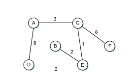

# Study Guide: Computer Networking Chapter 3

### Required reading
Sections: 3.1, 3.2 (except 3.2.2), 3.3, and 3.4

## Switching Basics

### Questions:
1. What is switching in computer networking?
2. Explain the difference between circuit switching and packet switching.
3. What are the advantages of packet switching over circuit switching?
4. What is a switch? How does it differ from a hub?
5. Describe the process of switching a packet within a switch.
6. What is store-and-forward switching? How does it ensure data integrity?

### Exercises:
1. Compare and contrast the performance characteristics of circuit switching and packet switching.
2. Research and list three different types of switches commonly used in computer networks.
3. Design a simple network topology using switches to connect multiple computers. Label the switches and computers in your diagram.

## Switched Ethernet

### Questions:
1. What is Ethernet? How does it work?
2. Explain the concept of a collision domain in Ethernet.
3. What are learning bridges?
4. Explain the Spanning Tree Algorithm
5. What are VLANs?

## Internet (IP)

### Questions:
1. What is the Internet Protocol (IP)? How does it work?
2. Explain the difference between IPv4 and IPv6.
3. What is an IP address? How is it structured?
4. What is the purpose of subnetting in IP addressing?
5. Describe the process of IP packet forwarding.
6. What is the role of the Internet Control Message Protocol (ICMP) in IP?

### Exercises:
1. Convert the following IPv4 address to binary: 192.168.0.1.
2. Research and list three different classes of IP addresses.
3. Configure a computer to use a static IP address. Document the steps you followed.

## Routing

### Questions:
1. What is routing in computer networking?
2. Explain the difference between static routing and dynamic routing.
3. What is a routing table? How is it used in the routing process?
4. What is the purpose of a default gateway in routing?
5. Describe the process of routing a packet from source to destination.

## Exercises

1. For the network given in figure above, show how the link-state algorithm builds the routing table for node D.
